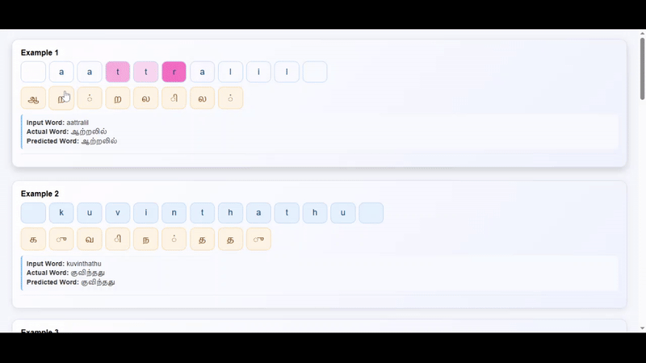

# DA6401 Assignment 3 - Seq2Seq

This repository contains a sequence-to-sequence transliteration system for converting Latin-script Tamil words into native Tamil script. The system is trained on the **Dakshina dataset** and supports both vanilla and attention-based encoder-decoder models using GRU/LSTM/RNN cells.

##  Project Structure
```
.
├── train.py                  # Training loop call from Sweep
├── sweep.py                  # WandB hyperparameter sweep script
├── tt_hyperprams.py          # Train Test w/ Best Hyperparameter
├── lib/
│   ├── seq2seq.py            # Model architecture
│   └── utils.py              # Data loaders & helpers
├── helper/
│   ├── heatmap_ploter.py     # Attention map visualizer
│   └── word_confusion.py     # Confusion matrix & error analysis
├── checkpoints/              # Saved best models (.pth)
├── predictions_attention/    # Test predictions (attention)
├── predictions_vanilla/      # Test predictions (vanilla)
├── Plots/                    # Heatmaps and connectivity diagrams
└── wandb/                    # Weights & Biases logs
```

### Hyperparameter for Sweeping
```json
{
    "method": "bayes",
    "name": "translit-seq2seq-tamil",
    "metric": {
        "name": "val_accuracy",
        "goal": "maximize"
    },
    "parameters": {
        "emb_dim": {"values": [16,32,64,256]},
        "hid_dim": {"values": [16,32,64,256]},
        "enc_layers": {"values": [1,2,3]},
        "dec_layers": {"values": [1,2,3]},
        "cell_type": {"values": ["rnn","gru","lstm"]},
        "dropout": {"values": [0.0,0.1]},
        "lr": {"values": [1e-2,1e-4]},
        "batch_size": {"values": [32,64]},
        "beam_size":   {"values": [1,5,10]},
        "max_len": { "values": [32]},
        "epochs": {"values": [15,20]},
        "use_attention": {"values": ["False"]},
        "bidirectional": {"values": ["True", "False"]},
        "teacher_forcing_ratio":{"values": [0.0,0.2]},
    }
}
```

### Run a Sweep

```bash
python sweep.py
```

### Analyze Errors

```bash
python helper/word_confusion.py
```

### Visualize Attention

```bash
python helper/heatmap_ploter.py
```

## Best Models

| Model         | Word Accuracy | Token Accuracy |
| ------------- | ------------- | -------------- |
| Vanilla GRU   | 39.60%        | 77.86%         |
| Attention GRU | **41.52%**    | 73.98%         |

* Best Vanilla Model config:
   ```json
   { 
    "batch_size": 32, "beam_size": 5,
    "bidirectional": false, "cell_type": "gru",
    "dec_layers": 2, "dropout": 0.1, "emb_dim": 64,
    "enc_layers": 2, "epochs": 15, "hid_dim": 256,
    "lr": 0.0001, "max_len": 32, "teacher_forcing_ratio": 0.2,
    "use_attention": false 
    }
  ```
* Best Attention Model config:
  ```json
    {
    "batch_size": 32, "beam_size": 5, "bidirectional": "false",
    "cell_type": "gru", "dec_layers": 2, "dropout": 0.1,
    "emb_dim": 32, "enc_layers": 2, "epochs": 20, "hid_dim": 256,
    "lr": 0.0001, "max_len": 32,"teacher_forcing_ratio": 0.2,
    "use_attention": "True"
    }
  ```


## Insights
* Attention helps improve alignment for longer sequences (e.g., "appakuthikalil").
* It helps recover proper prefixes/suffixes lost in the vanilla model.
* Still makes occasional phoneme-level errors (e.g., unthum → ந்தும்).
* **Attention model** corrected several errors made by the vanilla model (e.g., `kuvinthathu`, `aattralil`, `appakuthikalil`).
* **Common mistakes** involved confusions with `்`, `ர`, `ன`, and `ி`, especially in longer or consonant-heavy sequences.
* **Character-level analysis** (from `word_confusion.py`) shows:

  * Vowel errors (vanilla): 2196 vs. (attention): 1730
  * Consonant errors (vanilla): 3231 vs. (attention): 3289
* **Attention heatmaps** for 10 examples
 

## Connectivity visualation for the Attention model

